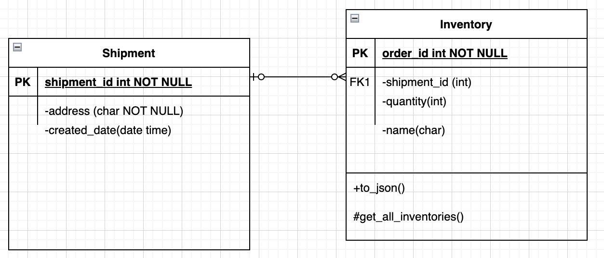

# Shopify-Backend-intern-challenge
## Task
Build an inventory tracking web application for a logistics company. We are looking for a web application that meets the requirements listed below, along with one additional feature.

project demonstrates basic CRUD operations and an enhancement (Ability to create “shipments” and assign inventory to the shipment,
and adjust inventory appropriately)

It uses a dev and test database for integration testing, appropriate database is selected in the app/_init__ file
but the user needs just a test database

Uses the python language and pip package handler, please have them installed

also uses the Flask framework

Uses SQLALCHEMY, an ORM and alembic a tool to support SQLALCHEMY database migrations they work with the flask framework.
also uses psycopg2 - a PostgreSQL database adapter for python

## Setup Steps

Clone repo, git clone 
```
https://github.com/AishaA-cpu/Shopify-Backend-intern-challenge.git
```

cd into repo

and create a virtual env in your dir
create virtual env, 
```
python -m venv venv
```
activate vitual env, - 
```
source venv/bin/activate
```
verify that you are working in a python virtual env
    ```
    python --version
    ``` 
should output a Python 3 version
    ```
    pip --version
    ```

required dependencies for this project are in the requirements.txt,
it is recommended to install dependencies in a virtual ENV
```
pip install -r requirements.txt
```

This project uses postgres RDB, to create one, download postgres and follow setup and create a database

create a .ENV file and set environment variables to point to data base
please use the "SQLALCHEMY_TEST_DATABASE_URI" and set the the first part of the values to "postgresql+psycopg2:"

e.g 
```
"SQLALCHEMY_TEST_DATABASE_URI"= "postgresql+psycopg2: path/to/your/test/database"
```
conftest file creates and drops(cleans up) records in your test database for testing purposes

After creating database and connection string:

one time setup, -> 
```
run flask db init
``` 
to init database and connect to flask
app/tests/test_route.py -> holds all integration tests for the routes
please run pytest in the root folder

## Run the server locally 
as an alternative to the tests definied in the routes_test_file
you can run the server locally
```
flask run
``` 
to run the flask server in developement mode or 
``` 
FLASK_ENV=development flask run
``` 
to run in debug mode
 
Default Flask Server URL is 
```
localhost:5000
```
we can use postman to send requests to 
```
http://localhost:5000
``` 
stop the server with 
```
ctrl c
```
for example a get request to will get all inventories
```
http://localhost:5000/inventories
``` 

these routes accept json files for post request so please set 
```
content-type to application/json
``` 

example of the  exact shape for json files are in the tests_routes.py file
if running locally please set .env file database base variable name with 
```
"SQLALCHEMY_DATABASE_URI"
```

## ERD OF CLASSES

